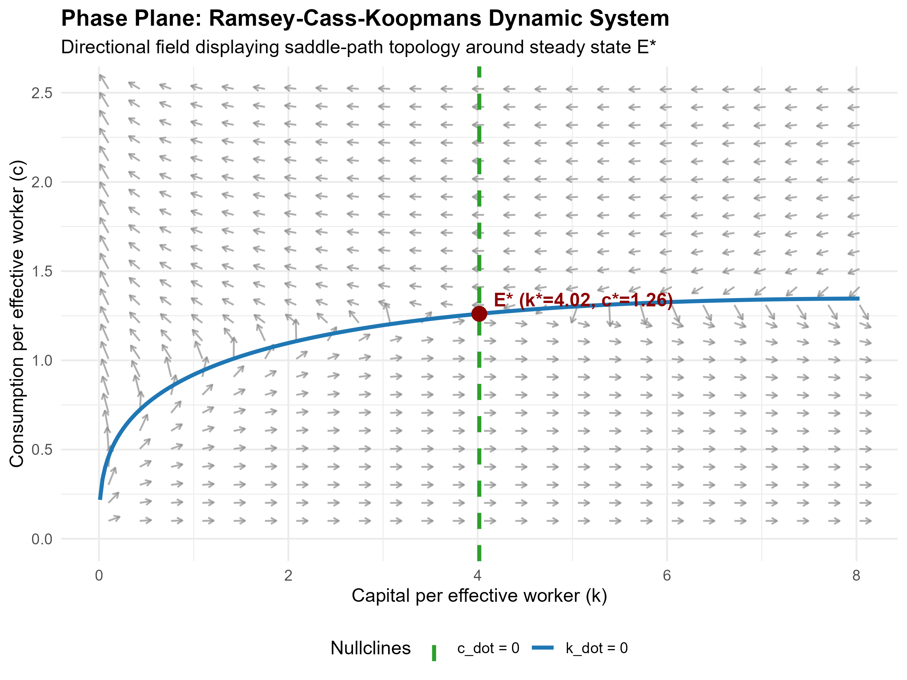
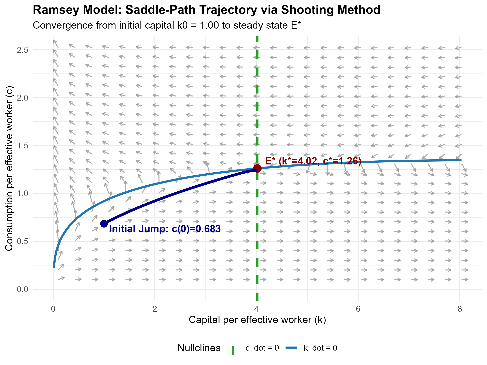

# Continuous-Time Ramsey-Cass-Koopmans Growth Model
### Numerical ODE Simulation & Saddle-Path Shooting in R

This repository provides an implementation of the continuous-time **Ramsey-Cass-Koopmans (RCK)** neoclassical growth model in **R**. It solves the core boundary value problem (BVP) of macroeconomic dynamic optimization using a **bisection shooting algorithm** and numerical integration via `deSolve`.

---

## 1. Mathematical Framework

The economy is modeled in intensive units (per effective worker $AL$):

### Capital Accumulation Constraint ($\dot{k}$)
$$\dot{k}(t) = k(t)^\alpha - c(t) - (n + g + \delta)k(t)$$

* $k(t)^\alpha$: Output per effective worker (Cobb-Douglas technology).
* $c(t)$: Consumption per effective worker.
* $(n + g + \delta)k(t)$: Effective capital depreciation from physical wear ($\delta$), population growth ($n$), and technological progress ($g$).

### Household Euler Optimization ($\dot{c}$)
Maximizing intertemporal utility with Constant Relative Risk Aversion (CRRA) preferences yields the continuous-time Euler equation:
$$\dot{c}(t) = \frac{c(t)}{\theta} \left[ \alpha k(t)^{\alpha - 1} - (\rho + \delta + \theta g) \right]$$

* $\theta$: Inverse intertemporal elasticity of substitution (risk aversion).
* $\rho$: Subjective rate of time preference (impatience).
* $\alpha k(t)^{\alpha - 1}$: Marginal product of physical capital.

---

## 2. Steady State & Saddle-Path Stability

Setting $\dot{k} = 0$ and $\dot{c} = 0$:

$$k^* = \left( \frac{\alpha}{\rho + \delta + \theta g} \right)^{\frac{1}{1 - \alpha}}$$
$$c^* = (k^*)^\alpha - (n + g + \delta)k^*$$

### Jacobian Linearization
Linearizing the non-linear dynamic system around $(k^*, c^*)$:

$$J = \begin{bmatrix} \rho - n + (\theta - 1)g & -1 \\ \frac{c^* \alpha (\alpha - 1)(k^*)^{\alpha - 2}}{\theta} & 0 \end{bmatrix}$$

Because capital share $\alpha < 1$, the determinant $\det(J) < 0$. This confirms **saddle-path stability**:
* One negative eigenvalue ($\lambda_1 < 0$): Stable manifold.
* One positive eigenvalue ($\lambda_2 > 0$): Unstable manifold.

---

## 3. Numerical Simulation Results

### Phase Plane & Directional Vector Field
The plot below maps the nullclines ($\dot{k} = 0$ and $\dot{c} = 0$) alongside normalized vector arrows showing directional velocities:



### Saddle-Path Trajectory (Shooting Method)
Because $k(0)$ is a predetermined state variable and $c(0)$ is a forward-looking jump variable, standard forward integration fails due to the positive eigenvalue. Using a **bisection shooting algorithm**, we compute the exact initial consumption $c(0) = 0.68322$ required to transition from $k_0 = 1.0$ to steady state $E^*$:



---

## 4. Repository Structure

```text
├── R/
│   ├── 01_model_equations.R   # Continuous ODE system
│   ├── 02_steady_state.R       # Analytical steady state & Jacobian matrix
│   ├── 03_phase_plane.R        # Vector field generation via ggplot2
│   └── 04_shooting_solver.R    # Bisection shooting algorithm
├── output/
│   ├── figures/               # Exported plots (.png)
│   ├── steady_state_summary.csv
│   └── saddle_path_trajectory.csv
├── main.R                     # Master pipeline execution script
└── README.md                  # Project documentation & derivations


